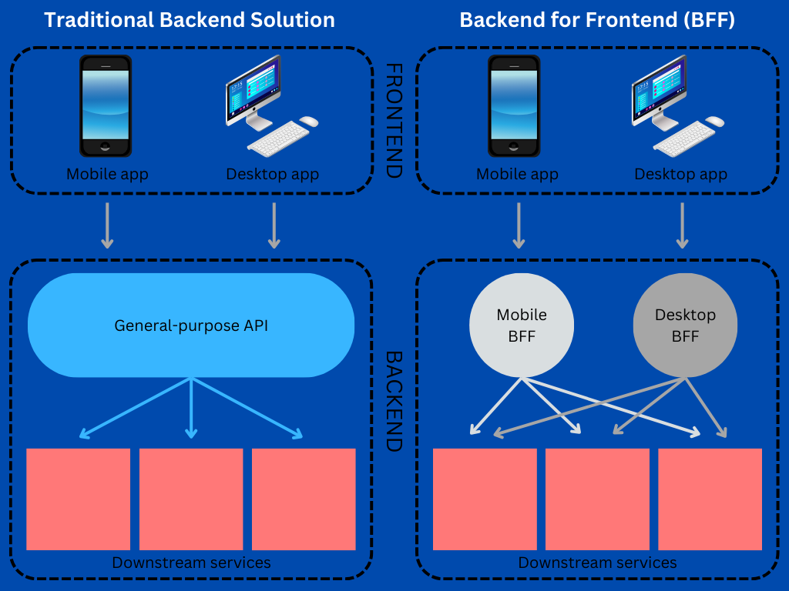

# 🖥️📱 Backends for Frontends (BFF) Pattern

## 🧩 Descripción

El patrón **Backends for Frontends (BFF)** propone crear una **capa de backend específica para cada tipo de cliente** (web, móvil, dispositivos IoT, etc.) en lugar de tener una API única y genérica para todos.

Este patrón permite **adaptar la lógica, datos y experiencia de usuario** a las necesidades particulares de cada interfaz de consumo, reduciendo la complejidad en el frontend y mejorando el rendimiento general.

---

## 🎯 ¿Qué problema soluciona?

Cuando diferentes tipos de clientes consumen una misma API genérica, pueden surgir varios problemas:

- Overfetching: el cliente recibe más datos de los que necesita.
- Underfetching: el cliente debe hacer múltiples llamadas para obtener lo necesario.
- Lógica de presentación duplicada en cada cliente.
- Complejidad al manejar diferentes flujos o versiones.

**BFF propone crear APIs adaptadas al frontend**, permitiendo desacoplar la lógica de presentación del dominio y optimizar la comunicación.

---

## 🧠 ¿Cómo funciona?

- Cada tipo de cliente (mobile, web, etc.) tiene su propio backend (BFF).
- Los BFFs interactúan con los microservicios o APIs del dominio.
- Los BFFs agregan, transforman o filtran la información antes de entregarla al cliente.
- Permiten inyectar reglas específicas sin modificar el dominio.

---

## ✅ Casos de uso

- Aplicaciones móviles con requisitos de rendimiento específicos.
- SPAs (Single Page Applications) que requieren formatos de datos distintos.
- Interfaces IoT que consumen sólo un subconjunto de funcionalidades.
- Personalización de flujos de usuario por canal.

---

## 📦 Beneficios
- 🧘‍♂️ Adaptación específica para cada canal.
- 🔄 Reducción de lógica duplicada en el cliente.
- ⚡ Mejor rendimiento en clientes móviles (menos carga).
- 🚀 Permite a los equipos de frontend y backend trabajar de forma más independiente.
- 🧩 Ideal para micro frontends y microservicios.

## ⚠️ Desafíos
- Mayor número de componentes a mantener (uno por canal).
- Posible duplicación de lógica entre BFFs si no se gestiona bien.
- Necesidad de definir claramente responsabilidades para evitar mezclar lógica de negocio con presentación.

---

[Menú Principal](https://github.com/wilfredoha/cloud-architecture-patterns)