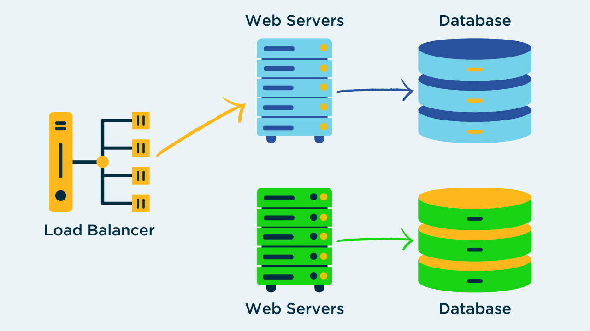

# 🔵🟢 Blue-Green Deployment Pattern

## 🧩 Descripción

**Blue-Green Deployment** es una estrategia en la cual existen **dos entornos idénticos**: uno activo (por ejemplo, "Blue") y uno pasivo ("Green").  
Las actualizaciones de la aplicación se realizan primero en el entorno pasivo.  
Luego, el tráfico de usuarios se redirige al nuevo entorno de forma controlada, minimizando el tiempo de inactividad y los riesgos.

---

## 🎯 ¿Qué problema soluciona?

- **Evita downtime** durante el despliegue.
- Permite realizar pruebas completas en el entorno pasivo antes de exponer a los usuarios.
- Facilita **rollbacks rápidos**: simplemente redirigiendo el tráfico de nuevo al entorno anterior.

---

## ⚙️ ¿Cómo funciona?

1. El entorno **Blue** está en producción y atiende a los usuarios.
2. Se prepara la nueva versión en el entorno **Green** (sin impactar usuarios).
3. Se ejecutan pruebas y validaciones sobre **Green**.
4. Si todo es exitoso, se **cambia el enrutamiento** (load balancer, DNS, etc.) para enviar el tráfico a **Green**.
5. **Blue** permanece como backup temporal por si es necesario volver atrás.

---

## ✅ Casos de uso

- Aplicaciones Web donde el tiempo de inactividad no es aceptable.
- Microservicios críticos desplegados en Kubernetes, EC2 o VMs tradicionales.
- APIs backend que requieren alta disponibilidad durante actualizaciones.

---

## 📦 Beneficios

- **Alta disponibilidad**: Actualización casi sin interrupciones.
- **Seguridad en despliegues**: Si algo falla, el rollback es inmediato.
- **Pruebas realistas**: Permite pruebas en un entorno idéntico al de producción.

---

## ⚠️ Consideraciones

- Requiere **duplicar infraestructura**, lo cual puede aumentar los costos temporalmente.
- Datos compartidos (por ejemplo, bases de datos) deben estar sincronizados entre Blue y Green.
- Asegúrate de que el proceso de cambio de tráfico sea atómico y seguro.

---

[Menú Principal](https://github.com/wilfredoha/cloud-architecture-patterns)