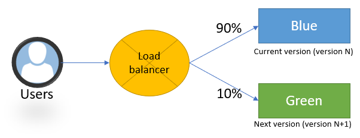

# 🐤 Canary Release & A/B Testing Deployment Patterns

## 🧩 Descripción

**Canary Release** y **A/B Testing** son estrategias de despliegue progresivo donde nuevas versiones de una aplicación se exponen primero a un subconjunto de usuarios.  
El objetivo es **detectar errores, medir impacto y validar hipótesis** antes de realizar un despliegue completo.

---

## 🎯 ¿Qué problema solucionan?

- Reducen el riesgo de fallos en producción.
- Permiten validar nuevas funcionalidades en condiciones reales.
- Facilitan decisiones basadas en datos (por métricas de usuario y comportamiento).

---

## ⚙️ ¿Cómo funciona?

### Canary Release

1. Se despliega la nueva versión solo para un pequeño porcentaje de usuarios (por ejemplo, 1%-5%).
2. Se monitorean métricas críticas: latencia, errores, conversiones, etc.
3. Si todo es estable, se aumenta progresivamente el porcentaje de tráfico dirigido a la nueva versión.
4. Finalmente, toda la carga pasa a la nueva versión.

### A/B Testing

1. Se despliegan **dos o más variantes** (A, B, C, etc.) simultáneamente.
2. Usuarios son asignados a variantes de forma aleatoria o segmentada.
3. Se comparan métricas entre variantes para determinar cuál ofrece mejores resultados (por ejemplo, tasa de clics, retención, compras).
4. Se elige la mejor variante para hacerla permanente.

---

## ✅ Casos de uso

- Validar nuevas funciones o cambios importantes en UX/UI.
- Probar nuevas optimizaciones de rendimiento.
- Realizar experimentos de negocio controlados en producción.

---

## 📦 Beneficios

- **Reducción de riesgos**: Solo una pequeña parte de usuarios se ve afectada inicialmente.
- **Toma de decisiones basada en datos**: Se elige la mejor versión según KPIs.
- **Mayor confianza en despliegues**: Detecta errores o degradaciones temprano.

---

## ⚠️ Consideraciones

- Necesitas una infraestructura capaz de **segmentar tráfico** (load balancers, feature flags, service mesh).
- Requiere **sistemas avanzados de monitoreo y métricas**.
- La gestión de versiones simultáneas puede ser compleja (considerar backward compatibility).
- Asegúrate de cumplir regulaciones sobre privacidad de datos cuando haces A/B Testing.

---

[Menú Principal](https://github.com/wilfredoha/cloud-architecture-patterns)