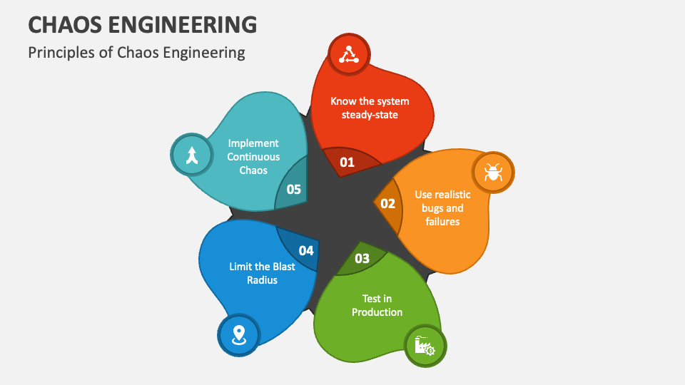

# 🌪️ Chaos Engineering Pattern

## 🧩 Descripción

**Chaos Engineering** es la práctica de experimentar de manera proactiva en sistemas distribuidos para identificar debilidades antes de que causen problemas en producción.  
Consiste en introducir fallas controladas para validar la resiliencia, la recuperación automática y la tolerancia a fallos del sistema.

---

## 🎯 ¿Qué problema soluciona?

- Permite descubrir puntos débiles ocultos en sistemas complejos.
- Aumenta la confianza en la resiliencia de las aplicaciones en producción.
- Mejora los tiempos de recuperación ante fallos reales.

---

## ⚙️ ¿Cómo funciona?

1. Se define una **hipótesis estable** ("el sistema seguirá funcionando si falla X").
2. Se diseña un **experimento controlado** para introducir fallos (caídas de red, indisponibilidad de servicios, degradaciones).
3. Se ejecuta el experimento de forma segura, preferiblemente en entornos de staging o bajo control en producción.
4. Se observan los efectos y se validan o rechazan las hipótesis.
5. Se corrigen los problemas detectados para mejorar la resiliencia.

---

## ✅ Casos de uso

- Validar la capacidad de recuperación automática de microservicios.
- Testear mecanismos de failover en bases de datos o colas de mensajes.
- Evaluar tiempos de recuperación ante caídas parciales de infraestructura.
- Asegurar que sistemas de monitoreo y alertas funcionen correctamente bajo estrés.

---

## 📦 Beneficios

- **Confianza operativa**: Sabes exactamente cómo se comporta tu sistema ante fallos.
- **Prevención proactiva**: Reduces la posibilidad de incidentes catastróficos.
- **Cultura de resiliencia**: Los equipos se enfocan en diseñar sistemas más robustos.

---

## ⚠️ Consideraciones

- Siempre define claramente el **alcance y límites** del experimento.
- Ejecuta primero en **entornos de pruebas** antes de hacerlo en producción.
- **Monitorea constantemente** durante y después de los experimentos.
- Asegúrate de contar con mecanismos de **rollback y recuperación rápida**.
- La práctica de Chaos Engineering debe ser progresiva y responsable.

---

[Menú Principal](https://github.com/wilfredoha/cloud-architecture-patterns)