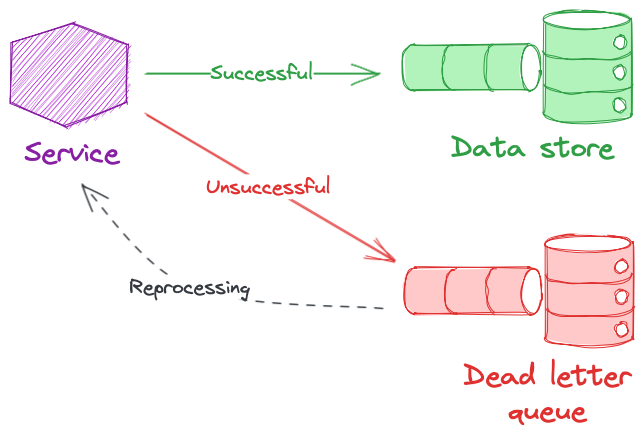

# 🪦 Dead Letter Queue (DLQ) Pattern

## 🧩 Descripción

Una **Dead Letter Queue (DLQ)** es una cola especial utilizada para almacenar **mensajes que no pueden ser procesados correctamente**. En lugar de perder estos mensajes o interrumpir el sistema, se redirigen a la DLQ para su análisis y manejo posterior.

Este patrón mejora la **fiabilidad**, **observabilidad** y **recuperación de errores** en sistemas distribuidos basados en colas de mensajes.

---

## 🎯 ¿Qué problema soluciona?

- 🔄 Evita bloqueos en colas principales por mensajes defectuosos.
- 🕵️‍♂️ Permite analizar y diagnosticar errores difíciles de detectar en tiempo real.
- 🛡️ Incrementa la resiliencia y tolerancia a fallos en arquitecturas event-driven.
- 🧹 Facilita estrategias de reprocesamiento manual o automatizado de mensajes fallidos.

---

## ⚙️ ¿Cómo funciona?

- Cada vez que un mensaje falla su procesamiento (tras un número definido de reintentos o por un error específico), se envía a una **Dead Letter Queue**.
- Los equipos de operaciones pueden analizar estos mensajes y decidir:
  - ❌ Descartarlo.
  - 🔄 Reprocesarlo (después de corregir la causa raíz).
  - 📋 Aplicar lógicas de compensación o corrección manual.

---

## ✅ Casos de uso

- Microservicios que se comunican mediante colas (**SQS**, **RabbitMQ**, **Kafka**).
- Sistemas de ingestión de datos donde el formato o validación puede fallar.
- Aplicaciones serverless que procesan eventos asincrónicos (**AWS Lambda**, **Azure Functions**).

---

## 📦 Ejemplo práctico en AWS SQS

**Main Queue**:
- Define un `Redrive Policy` para enviar mensajes a la DLQ después de, por ejemplo, **3 reintentos fallidos**.

**DLQ**:
- Cola separada para almacenar mensajes fallidos.
- Puede tener reglas de alertas (**SNS**) para notificar automáticamente sobre nuevos mensajes en la DLQ.

---

## 🛠️ Configuraciones importantes

| Configuración            | Descripción |
|---------------------------|-------------|
| Maximum Receive Count     | Número de veces que un mensaje puede fallar antes de ser movido a la DLQ. |
| Visibility Timeout        | Tiempo que el mensaje no es visible tras fallar, antes de intentar reprocesarlo. |
| Message Retention         | Tiempo máximo que un mensaje puede permanecer en la DLQ antes de ser eliminado. |

---

## ⚠️ Consideraciones

- No ignores las DLQ: deben ser **monitoreadas y analizadas regularmente**.
- Implementa **alertas automáticas** para detectar acumulaciones anormales en la DLQ.
- No uses DLQ como una estrategia de **"guardar todo lo que falla sin revisarlo"**.
- Define **procedimientos claros** para el manejo de mensajes en DLQ: reprocesamiento manual, automatizado o eliminación.

---

[Menú Principal](https://github.com/wilfredoha/cloud-architecture-patterns)