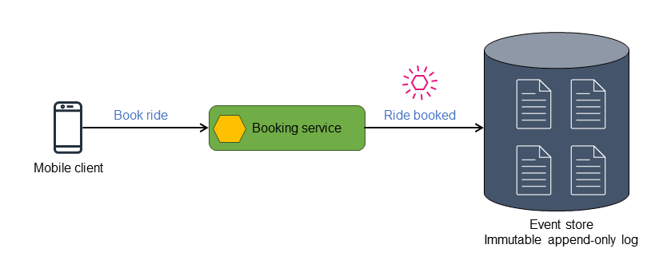

# Event Sourcing Pattern – Source of Truth Through Events

## 🧩 Descripción

**Event Sourcing** es un patrón arquitectónico donde el **estado de una entidad no se almacena como una fila en una base de datos tradicional**, sino como una **secuencia inmutable de eventos** que representan todos los cambios ocurridos en esa entidad a lo largo del tiempo.

En lugar de sobrescribir datos, **cada cambio se guarda como un nuevo evento**, y el estado actual puede reconstruirse reproduciendo esa secuencia de eventos.

---

## ✅ ¿Qué problema soluciona?

### Problemas en arquitecturas tradicionales:
- Pérdida del historial de cambios.
- Imposibilidad de auditar lo que ocurrió y cuándo.
- Dificultad para reconstruir el pasado de una entidad.
- Actualizaciones complejas en estructuras de dominio complejas.

### Event Sourcing lo soluciona al:
- Guardar cada cambio como un evento independiente.
- Permitir reconstrucción completa del estado de una entidad.
- Habilitar trazabilidad, auditoría y análisis histórico.
- Soportar patrones como CQRS, Materialized Views y Event Replay.

---

## 🎯 Casos de uso

- Sistemas financieros (banca, pagos, contabilidad).
- Logística, supply chain, e-commerce.
- Aplicaciones que requieren auditoría detallada.
- Sistemas donde los datos deben ser recuperables o versionados.
- Implementación de **event replay** o reconstrucción de sistemas fallidos.

---

## ✅ Beneficios
- 🔍 Auditoría completa: cada cambio queda registrado.
- 🕰️ Reproducibilidad: puedes reconstruir cualquier estado en cualquier punto del tiempo.
- ⚙️ Escalabilidad: acopla bien con CQRS, microservicios y event-driven systems.
- 🧪 Testing & Debugging: fácil de simular estados o escenarios.

---

## ⚠️ Desafíos
- Mayor complejidad en el diseño e implementación.
- Reconstrucción del estado puede ser costosa sin snapshots.
- Gestión de evolución de esquemas de eventos.
- Requiere habilidades adicionales en diseño de eventos y proyecciones.

## 💡 Buenas prácticas
- Usa snapshots periódicos para evitar recorrer toda la historia.
- Diseña eventos como contratos inmutables y versionables.
- Usa tipado fuerte para eventos (idealmente con validaciones).
- Asegura la idempotencia en proyecciones.

---

[Menú Principal](https://github.com/wilfredoha/cloud-architecture-patterns)