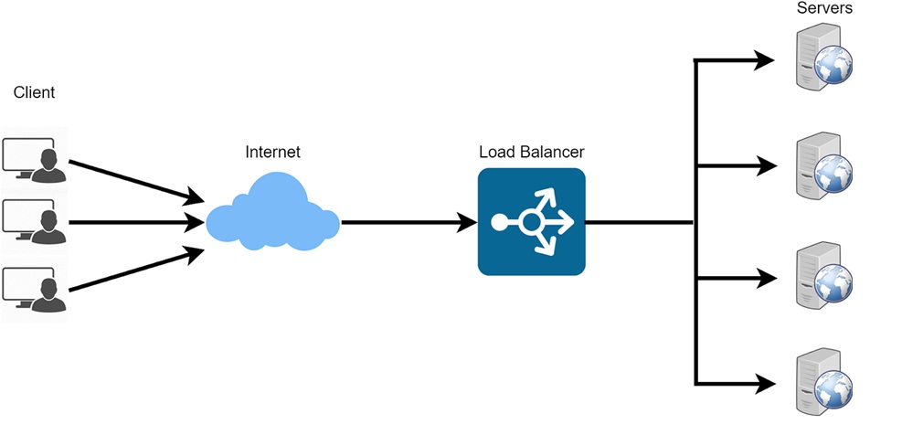
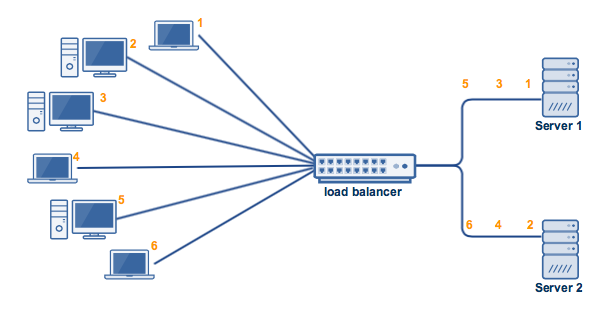
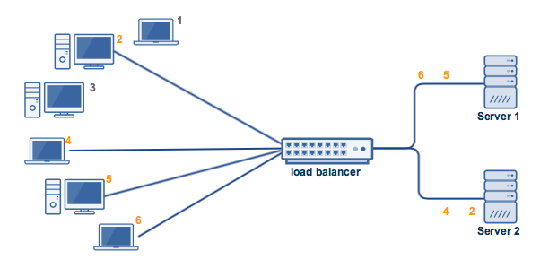
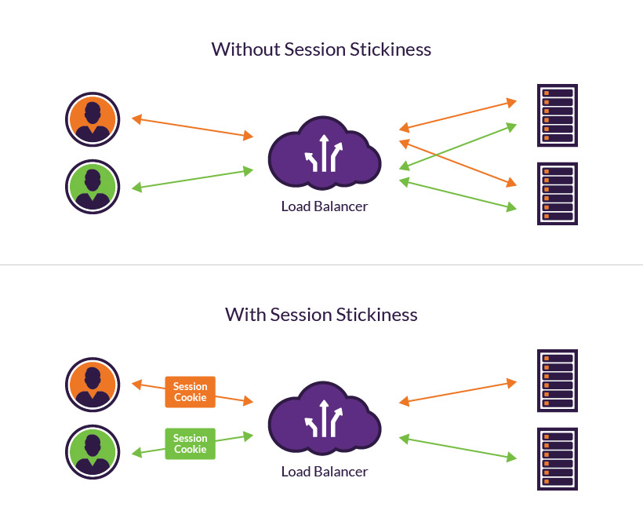
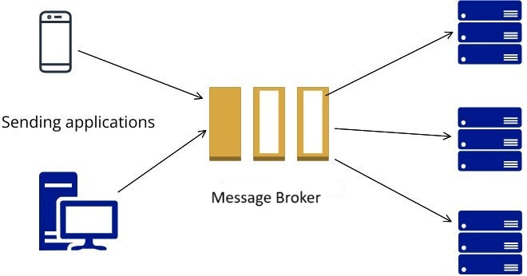

# Load Balancing Pattern

## 🧩 Descripción

El patrón de **Load Balancing** se utiliza para distribuir automáticamente solicitudes o cargas de trabajo entre múltiples instancias de un componente o servicio, evitando sobrecargas y maximizando la eficiencia y disponibilidad del sistema.

---

## ✅ ¿Qué problema soluciona y cómo?

### Problemas:
- Saturación de un solo servidor o recurso (bottlenecks).
- Latencia elevada al procesar múltiples solicitudes simultáneas.
- Baja disponibilidad cuando una instancia falla.
- Escalabilidad limitada al tener una única instancia que atiende todas las solicitudes.

### ¿Cómo lo soluciona?
- Distribuye solicitudes entrantes entre múltiples instancias disponibles.
- Mejora el rendimiento del sistema mediante procesamiento paralelo.
- Incrementa la resiliencia al redirigir tráfico fuera de instancias con fallos.
- Facilita el escalado horizontal mediante incorporación de nuevas instancias dinámicamente.

---

## 🎯 Casos de uso

- **Aplicaciones web** de alto tráfico.
- **Sistemas backend para móviles**, IoT o APIs RESTful.
- Arquitecturas **microservicio**, donde múltiples instancias deben procesar eventos o solicitudes.
- Procesamiento paralelo de tareas intensivas (cargas por lotes, renderizado de imágenes, etc).

---

## 🔄 Algoritmos de balanceo de carga

1. **Round Robin**  
   Envía cada solicitud a la siguiente instancia disponible en orden circular. Simple y efectivo en sistemas simétricos.
   

2. **Least Connections**  
   Redirige la solicitud a la instancia con menos conexiones activas. Ideal cuando las cargas de procesamiento no son uniformes.
   

3. **Sticky Sessions (Session Affinity)**  
   Mantiene la sesión de un usuario asignada a una instancia específica. Útil cuando la aplicación guarda estado en memoria local, aunque no se recomienda para arquitecturas escalables.
   

---

## 📦 Uso de Message Broker como Load Balancer

Aunque tradicionalmente el balanceo se realiza a nivel HTTP o TCP, en arquitecturas **event-driven** o **asíncronas**, se puede simular balanceo de carga utilizando un **message broker** como:

- **Amazon SQS**, **RabbitMQ**, **Apache Kafka**, **Google Pub/Sub**

### ¿Cómo funciona?
- Productores (clientes) envían mensajes a una cola o tópico.
- Múltiples consumidores (workers) leen desde la misma cola.
- Cada consumidor procesa los mensajes de forma independiente.
- El message broker garantiza distribución balanceada entre consumidores.

### Beneficios:
- Aislación entre productores y consumidores.
- Balanceo implícito sin necesidad de un load balancer clásico.
- Permite escalado automático del número de consumidores según demanda.

---

## ⚙️ Autoscaling

El patrón de Load Balancing se potencia cuando se combina con **autoscaling**, especialmente en entornos cloud:

- **Horizontal Autoscaling**: Agrega o elimina instancias según carga (CPU, memoria, latencia).
- El balanceador detecta nuevas instancias y las incluye automáticamente.
- Servicios como **AWS Auto Scaling Groups**, **Kubernetes HPA**, **Azure VMSS**, permiten implementar esto.

> Ejemplo: Si la CPU de las instancias supera el 70% por más de 5 minutos, se agregan 2 nuevas instancias que serán incluidas por el Load Balancer.

---

## 🛠️ Tecnologías comunes

- **Balanceadores de carga**:
  - AWS Elastic Load Balancer (ELB, ALB, NLB)
  - NGINX, HAProxy, Envoy
- **Service Discovery**:
  - Consul, Eureka, AWS Cloud Map
- **Client-side Load Balancing**:
  - Ribbon, gRPC, Spring Cloud LoadBalancer

---

[Menú Principal](https://github.com/wilfredoha/cloud-architecture-patterns)