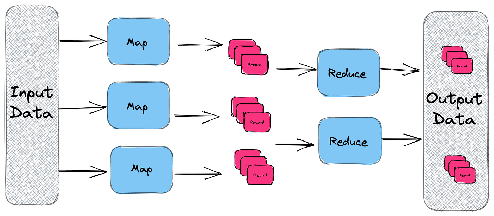

# Map Reduce Pattern for Big Data Processing

## 🧩 Descripción

**MapReduce** es un patrón de procesamiento de datos que divide una tarea compleja en dos fases fundamentales: **Map** y **Reduce**. Está diseñado para manejar de forma eficiente grandes volúmenes de datos distribuidos a través de múltiples nodos de cómputo.

- **Map**: Procesa los datos de entrada y los transforma en pares clave-valor.
- **Reduce**: Agrupa estos pares por clave y realiza operaciones de agregación para producir el resultado final.

Es ampliamente utilizado en entornos de Big Data, como análisis de logs, procesamiento de eventos históricos, y generación de reportes masivos.

---

## ✅ ¿Qué problema soluciona?

### Problemas comunes:
- Procesamiento ineficiente de grandes cantidades de datos en una sola máquina.
- Limitaciones de escalabilidad y recursos en sistemas monolíticos.
- Procesamiento lento y costoso de tareas complejas como agregaciones, conteos o análisis de logs.

### ¿Cómo lo soluciona?
- Divide y conquista: separa la tarea en subprocesos paralelos distribuidos (Map).
- Luego consolida los resultados parciales (Reduce).
- Esto permite escalar horizontalmente el procesamiento y aprovechar múltiples máquinas o nodos de cómputo.

---

## 🎯 Casos de uso

- Conteo de palabras o frases en millones de documentos.
- Análisis de logs de tráfico web.
- Generación de reportes de ventas o métricas históricas.
- Procesamiento de datos de sensores IoT en lote.
- Indexación de grandes volúmenes de texto (como motores de búsqueda).

---

## ☁️ Ejemplo de implementación en la nube

| Plataforma         | Servicios relevantes                  |
|-------------------|----------------------------------------|
| AWS               | Amazon EMR, AWS Lambda + S3, AWS Glue |
| Google Cloud      | Cloud Dataflow (Apache Beam)           |
| Azure             | Azure HDInsight, Azure Data Lake       |
| Open Source       | Apache Hadoop, Apache Spark            |

---

## 🧱 Arquitectura

### 1. Data Source (Input Split)
- El dataset se divide en fragmentos manejables.
- Ejemplo: 1 archivo de 1TB dividido en 1000 archivos de 1GB.

### 2. Map Phase
- Cada fragmento es procesado por una función "Map".
- Se generan pares clave-valor intermedios.

### 3. Shuffle and Sort
- Se agrupan los valores por clave.
- Redistribución de los pares clave-valor para consolidar.

### 4. Reduce Phase
- Para cada clave, se aplican funciones de agregación como `sum()`, `count()`, `average()`, etc.

### 5. Data Sink (Output)
- El resultado final se almacena en S3, HDFS, Data Lake u otra base de datos.

---

## 📈 Beneficios
- Permite procesar datos a gran escala (> TB) de forma distribuida.
- Tolerancia a fallos mediante reintentos en tareas individuales.
- Escalabilidad horizontal (más nodos = más velocidad).
- Compatible con arquitecturas batch y serverless.

---

## ⚠️ Desafíos
- No es adecuado para procesamiento en tiempo real (batch-oriented).
- La fase de Shuffle and Sort puede ser costosa en red y E/S.
- Necesidad de infraestructura distribuida para implementaciones grandes.
- Requiere diseñar funciones de Map y Reduce cuidadosamente para evitar cuellos de botella.

--- 

[Menú Principal](https://github.com/wilfredoha/cloud-architecture-patterns)