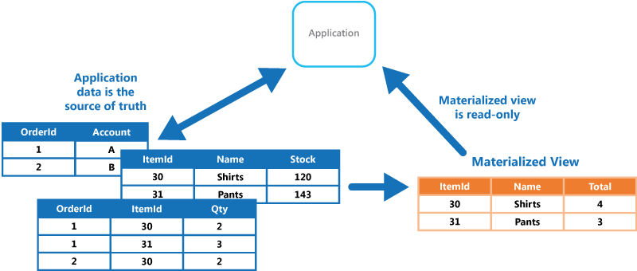

# Materialized View Pattern – Architecting High-Performance Systems

## 🧩 Descripción

El **Materialized View Pattern** consiste en generar y mantener vistas precomputadas y **optimizadas para lectura** a partir de datos de uno o más sistemas fuente. Estas vistas se almacenan en una base de datos separada y se actualizan de forma periódica o en tiempo real.

Este patrón es ampliamente utilizado en sistemas donde se requieren **lecturas rápidas y escalables**, y donde realizar cálculos en tiempo real sobre los datos originales sería costoso o ineficiente.

---

## ✅ ¿Qué problema soluciona?

### Problema:
- Las consultas complejas y agregaciones sobre bases de datos operacionales impactan el rendimiento.
- Mezclar lectura y escritura en una misma base puede causar **cuellos de botella** y **problemas de escalabilidad**.
- Los microservicios que necesitan datos derivados o combinados terminan acoplándose innecesariamente entre sí.

### Solución:
- Crear una vista materializada optimizada para lectura.
- Mantener esa vista sincronizada con el origen mediante sincronización batch, event-driven o CDC (Change Data Capture).
- Separar los modelos de escritura y lectura para escalar de forma independiente.

---

## 🎯 Casos de uso

- Dashboards analíticos o BI en tiempo real.
- Microservicios que consumen datos agregados de otros servicios.
- Optimización de búsquedas y rankings.
- Sistemas CQRS (Command Query Responsibility Segregation).
- Preprocesamiento de datos para reportes o exportaciones.

---

## 🧠 Técnicas de sincronización

| Enfoque              | Descripción                                             |
|----------------------|---------------------------------------------------------|
| Pull / Batch         | Tareas programadas que actualizan las vistas            |
| Push / Event-driven  | Eventos (`OrderCreated`, `UserUpdated`) disparan cambios |
| CDC                  | Usar cambios en logs de base de datos   |

---

## ✅ Beneficios
- Consultas más rápidas y eficientes.
- Aislamiento entre operaciones de lectura y escritura.
- Reducción de carga sobre bases de datos operacionales.
- Escalabilidad horizontal de componentes de lectura.
- Mejora la experiencia del usuario con dashboards en tiempo real.

## ⚠️ Desafíos
- Consistencia eventual: las vistas pueden no estar al 100% sincronizadas.
- Complejidad adicional en la sincronización y actualización.
- Costos de almacenamiento y mantenimiento de vistas.
- Duplicación de datos (si no se gestiona adecuadamente).

---

[Menú Principal](https://github.com/wilfredoha/cloud-architecture-patterns)