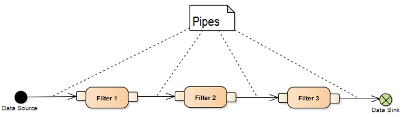
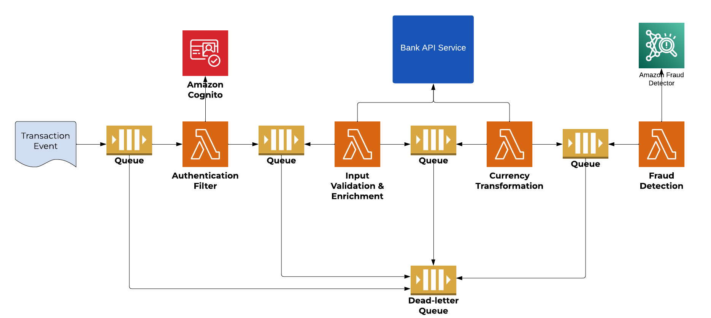

# Pipes and Filters Pattern

## 🧩 Descripción

El patrón **Pipes and Filters** se utiliza para procesar datos de forma secuencial a través de una serie de componentes independientes llamados **filtros** (*filters*), conectados por canales de comunicación llamados **tuberías** (*pipes*). 

Cada filtro transforma los datos que recibe y los pasa al siguiente a través de una pipe, permitiendo una arquitectura modular, escalable y desacoplada.

---

## ✅ ¿Qué problema soluciona y cómo?

### Problemas comunes:
- Procesamiento de datos monolítico, difícil de mantener o escalar.
- Imposibilidad de modificar o extender fácilmente los flujos.
- Acoplamiento entre las etapas del procesamiento.

### Solución:
- Divide el flujo en etapas reutilizables.
- Cada etapa puede escalarse, desplegarse y mantenerse de forma independiente.
- Se puede agregar, quitar o reemplazar filtros sin afectar el resto del flujo.

---

## 📦 Componentes clave

### 🔹 Data Source
Punto inicial donde se originan los datos a procesar.  
**Ejemplos:**
- Usuario sube un archivo (Frontend → API Gateway).
- Servicio de ingesta desde IoT, FTP, webhook o API.
- Lectura desde un bucket S3, base de datos, stream o cola.

### 🔹 Filters
Unidades que reciben datos, los transforman o procesan, y pasan el resultado al siguiente filtro.  
**Ejemplos:**
- Validar tipo de archivo.
- Extraer metadatos.
- Convertir formatos (ej. video o imagen).
- Clasificar contenido.

### 🔹 Pipes
Canales de comunicación entre filtros.  
**Ejemplos:**
- SQS, SNS, Kafka topics.
- Pipes de Bash/Linux.
- HTTP, gRPC, WebSockets.

### 🔹 Data Sink
Punto final del pipeline donde los datos se almacenan o notifican.  
**Ejemplos:**
- Almacenamiento definitivo (S3, base de datos, blob).
- Sistema de indexación (Elasticsearch).
- Envío de notificación al usuario.
- Trigger de un evento para otro sistema.

---

## 🎯 Casos de uso

- Procesamiento de medios (video, imagen, audio).
- ETL (Extract, Transform, Load).
- Workflows de validación de documentos.
- Pipelines de datos en IoT.
- Orquestación de microservicios basada en eventos.

---

## ☁️ Ejemplo de arquitectura cloud: procesamiento de video

