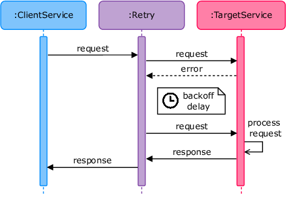

# 🔁 Retry Pattern

## 🧩 Descripción

El patrón **Retry** se utiliza para **volver a intentar una operación fallida**, con la esperanza de que sea exitosa en un intento posterior. Es especialmente útil cuando los errores son **transitorios**, como una latencia de red alta, un servicio momentáneamente caído o una base de datos con demasiadas conexiones.

Este patrón ayuda a **mejorar la resiliencia** de sistemas distribuidos, sin necesidad de intervención manual inmediata.

---

## 🎯 ¿Qué problema soluciona?

- 🌐 Fallos intermitentes de red o latencia.
- 🧱 Saturación temporal de recursos (ej. base de datos).
- 🔌 Caídas breves de servicios downstream.
- 💬 APIs externas que retornan errores temporales (502, 503, etc.).

En lugar de fallar inmediatamente, el sistema reintenta después de un **retraso configurable**, aumentando la posibilidad de éxito sin afectar la experiencia del usuario.

---

## 🧠 ¿Cómo funciona?

- Se detecta una **falla transitoria** en una operación.
- El sistema espera un período de tiempo y **vuelve a intentar**.
- Puede haber múltiples reintentos con **retrasos crecientes (backoff)**.
- Si se supera el número máximo de intentos, se **propaga el error** o se aplica un patrón complementario como Circuit Breaker o Dead Letter Queue.

---

## ⏱️ Estrategias de Retry

| Estrategia                  | Descripción |
|----------------------------|-------------|
| Retry inmediato            | Reintento inmediato sin retraso. Útil en errores muy raros. |
| Retry con intervalo fijo   | Se espera un mismo tiempo entre cada intento. Simple, pero puede provocar congestión. |
| Backoff exponencial        | Se duplica el tiempo entre cada intento (ej. 1s, 2s, 4s...). Reduce carga en sistemas saturados. |
| Backoff exponencial con jitter | Se agrega aleatoriedad para evitar patrones sincronizados entre clientes. Muy recomendado. |

---

## ✅ Casos de uso

- Comunicación entre microservicios en redes inestables.
- Operaciones idempotentes que pueden reintentarse sin efectos negativos.
- Llamadas a servicios de terceros (API REST, pagos, mensajería).
- Operaciones de escritura en sistemas eventualmente consistentes.

---

## ⚠️ Consideraciones
- No todas las operaciones son seguras para reintentar (ej. pagos).
- Debe combinarse con lógica de idempotencia.
- Es importante establecer un número máximo de intentos y tiempo total máximo.
- Puede exacerbar el problema si muchos clientes hacen retry simultáneamente.

---

## 🔒 Mejores prácticas
- Usa backoff exponencial con jitter como configuración por defecto.
- Marca operaciones como idempotentes si van a ser reintentadas.
- Registra todos los intentos para observabilidad.
- Combina con Circuit Breaker para evitar sobrecarga de servicios persistentemente fallando.

---

[Menú Principal](https://github.com/wilfredoha/cloud-architecture-patterns)