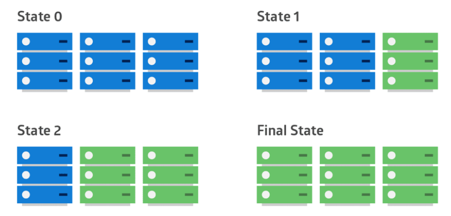

# 🔄 Rolling Deployment Pattern

## 🧩 Descripción

**Rolling Deployment** es una estrategia de despliegue en la cual se actualizan progresivamente las instancias de una aplicación o servicio, **una por una o en pequeños lotes**, hasta completar la migración a la nueva versión.

Este patrón permite minimizar el **downtime** y reduce el riesgo de fallos masivos al actualizar solo una parte del sistema a la vez.

---

## 🎯 ¿Qué problema soluciona?

- Minimiza la interrupción del servicio durante despliegues.
- Permite detectar errores de nuevas versiones de forma temprana antes de impactar a todos los usuarios.
- Facilita la reversión (rollback) en caso de fallo parcial.
- Permite validaciones y monitoreo progresivo en ambientes productivos.

---

## ⚙️ ¿Cómo funciona?

1. Se elige un pequeño grupo de instancias (por ejemplo, 5%-10% del total).
2. Se actualiza ese grupo a la nueva versión de la aplicación.
3. Se monitorea el comportamiento de las instancias actualizadas.
4. Si todo funciona correctamente, se continúa actualizando los siguientes lotes.
5. El proceso se repite hasta completar el despliegue de todas las instancias.

Si se detecta un problema en alguna fase, el proceso puede detenerse o revertirse.

---

## ✅ Casos de uso

- Actualización de microservicios desplegados en clústeres de **Kubernetes**.
- Despliegue de aplicaciones en instancias de **EC2** con **Auto Scaling Groups**.
- Renovación de versiones de contenedores en plataformas como **AWS ECS**, **Google Cloud Run** o **Azure App Service**.

---

## 📦 Beneficios

- **Alta disponibilidad**: Solo una fracción de instancias está fuera de servicio a la vez.
- **Reducción de riesgos**: Permite abortar rápidamente si se detectan errores.
- **Mejora continua**: Facilita validaciones en producción sin afectar la mayoría de los usuarios.

---

## ⚠️ Consideraciones

- Necesitas sistemas de monitoreo y alertas activos durante el despliegue.
- Puede haber **incompatibilidades** si diferentes versiones corren simultáneamente (asegúrate de tener versiones backward-compatible si es necesario).
- Rolling deployments pueden tardar más tiempo que un despliegue completo ("big bang").

---

[Menú Principal](https://github.com/wilfredoha/cloud-architecture-patterns)