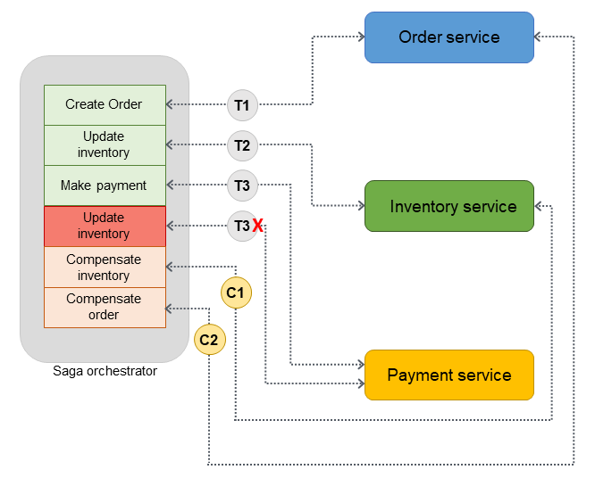
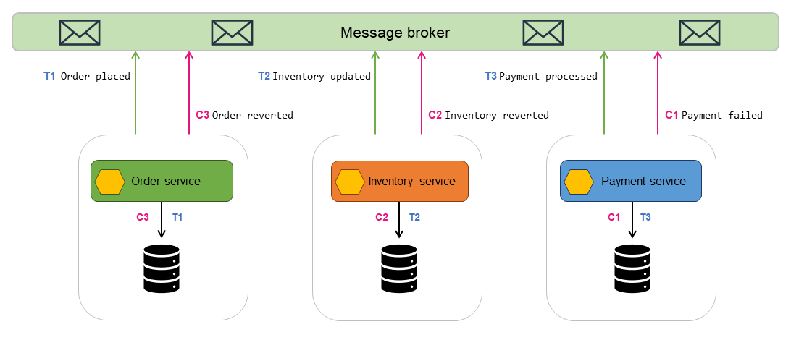

# The Saga Pattern – Distributed Transactions in Microservices

## 🧩 Descripción

El **Saga Pattern** es una estrategia para manejar **transacciones distribuidas** en arquitecturas de microservicios, en donde no se puede utilizar una transacción ACID tradicional. Una **saga** se compone de una secuencia de transacciones locales que se ejecutan en distintos servicios, cada una con una **acción compensatoria** en caso de que algo falle.

Es fundamental para mantener la **consistencia eventual** y permitir **rollback distribuido**.

---

## ✅ ¿Qué problema soluciona?

### Problema:
En una arquitectura de microservicios, no se puede utilizar una única transacción que abarque múltiples servicios debido a su naturaleza distribuida. Sin un mecanismo alternativo, los sistemas pueden quedar en estados inconsistentes.

### Solución:
El Saga Pattern coordina múltiples transacciones locales, asegurando que, si alguna falla, las anteriores puedan deshacerse mediante acciones de compensación, manteniendo así la integridad del sistema.

---

## 🎯 Casos de uso

- Procesos de compra en e-commerce (pedido → pago → envío).
- Reservas de vuelos, hoteles y autos.
- Gestión de suscripciones y renovaciones automáticas.
- Flujos de onboarding de usuarios distribuidos.
- Procesos de workflow empresarial con múltiples pasos y servicios.

---

## 🧱 Tipos de Saga

### 1. Saga con Orquestación

Un **servicio orquestador central** (como un orchestrator service, workflow engine o BPM) es el encargado de:
- Ejecutar los pasos de la saga.
- Monitorear los resultados.
- Invocar acciones compensatorias si algo falla.

#### Ventajas:
- Control centralizado del flujo.
- Visibilidad clara del estado de la saga.

#### Desventajas:
- Mayor acoplamiento al orquestador.
- Punto único de fallo y responsabilidad.

### 2. Saga con Coreografía
En este enfoque no hay un orquestador central. Cada servicio:
- Realiza su transacción local.
- Publica un evento indicando el resultado.
- Otros servicios escuchan esos eventos y reaccionan en consecuencia.

#### Ventajas:
- Bajo acoplamiento.
- Alta escalabilidad y resiliencia.

#### Desventajas:
- Difícil de rastrear el estado de toda la saga.
- Mayor complejidad para entender el flujo completo.

---

## ⚖️ Comparación: Orquestación vs. Coreografía

| Característica       | Orquestación                            | Coreografía                                |
|----------------------|------------------------------------------|---------------------------------------------|
| Control de flujo     | Centralizado                             | Distribuido                                 |
| Acoplamiento         | Medio                                    | Bajo                                        |
| Visibilidad          | Alta (desde el orquestador)              | Baja (requiere observabilidad)             |
| Complejidad          | En el orquestador                        | En el sistema completo                      |
| Escalabilidad        | Moderada                                 | Alta                                        |
| Tolerancia a fallos  | Limitada (si el orquestador falla)       | Alta                                        |

---

## 🧠 Beneficios del Saga Pattern
- Permite mantener consistencia sin transacciones distribuidas ACID.
- Facilita rollback parcial con acciones compensatorias.
- Adaptado a arquitecturas event-driven y microservicios.
- Mejor manejo de errores en flujos complejos.

---

## ⚠️ Desafíos
- Implementar acciones compensatorias no siempre es trivial.
- Difícil trazabilidad en coreografía si no hay observabilidad centralizada.
- Puede haber estados intermedios inconsistentes por un tiempo.
- Las pruebas de fallos y recuperación deben ser exhaustivas.

---

[Menú Principal](https://github.com/wilfredoha/cloud-architecture-patterns)