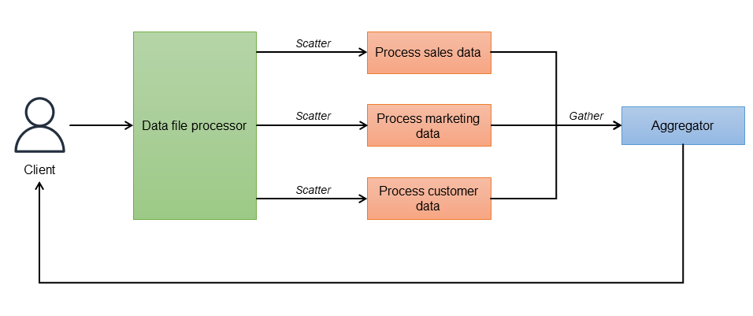

# Scatter-Gather Pattern

## 🧩 Descripción

El patrón **Scatter-Gather** permite dividir una tarea en múltiples subtareas que se ejecutan en paralelo (*scatter*) y luego recopila los resultados (*gather*) para procesarlos de forma conjunta o consolidada. 

Es útil cuando una operación puede o debe ser paralizada para mejorar rendimiento, disponibilidad o diversidad de fuentes de datos.

---

## ✅ ¿Qué problema soluciona y cómo?

### Problemas comunes:
- Procesos secuenciales que tardan demasiado al consultar múltiples fuentes.
- Necesidad de obtener la mejor respuesta entre múltiples opciones (como precios, tiempos, disponibilidad).
- Llamadas a servicios de terceros que pueden fallar o tardar demasiado.

### Solución:
- Divide el trabajo y lo ejecuta en paralelo.
- Espera los resultados de todas o algunas de las respuestas.
- Consolida o selecciona el mejor resultado.

---

## 🎯 Casos de uso

- Consultar múltiples proveedores externos (e.g., APIs de precios de vuelos, hoteles, productos).
- Búsqueda federada en múltiples bases de datos o servicios.
- Procesamiento paralelo de datos o tareas pesadas.
- Análisis paralelo de diferentes modelos de ML.

---

## ☁️ Implementación en entornos cloud

### 🔹 Servicios útiles:
- **AWS Lambda + SQS o SNS**
- **AWS Step Functions (Parallel State)**
- **Azure Durable Functions (Fan-Out/Fan-In)**
- **Apache Kafka o RabbitMQ**
- **Cloud Run o Cloud Functions (Google)**

---

## 📦 Componentes del patrón

- **Scatter (Dispersión)**: Envia múltiples tareas a servicios o workers.
- **Workers / Microservicios**: Ejecutan las tareas en paralelo.
- **Gather (Recolección)**: Espera, consolida y devuelve el resultado.

---

## 📌 Estrategias de recolección

- **Wait for all**: Espera a que todas las respuestas lleguen.
- **Timeout**: Espera hasta cierto tiempo, luego procesa lo que haya llegado.
- **First responder wins**: Usa la primera respuesta válida.
- **Majority / quorum**: Espera una cantidad mínima de respuestas.

---

## 📈 Ventajas
- Alto rendimiento y eficiencia (paralelización).
- Resiliencia: no depende de un único proveedor o servicio.
- Adaptabilidad: se puede aplicar para comparar, validar o enriquecer información.

---

## ⚠️ Desventajas
- Lógica de consolidación puede ser compleja.
- Riesgo de inconsistencia si hay respuestas contradictorias.
- Necesidad de manejo de fallos y timeouts en la etapa de "Gather".

---

## 🧠 Buenas prácticas
- Diseñar workers para ser idempotentes y resilientes.
- Definir límites de tiempo adecuados por respuesta.
- Usar tracing distribuido para rastrear cada rama de ejecución.
- Considerar casos en los que uno o más servicios fallen.

---

[Menú Principal](https://github.com/wilfredoha/cloud-architecture-patterns)