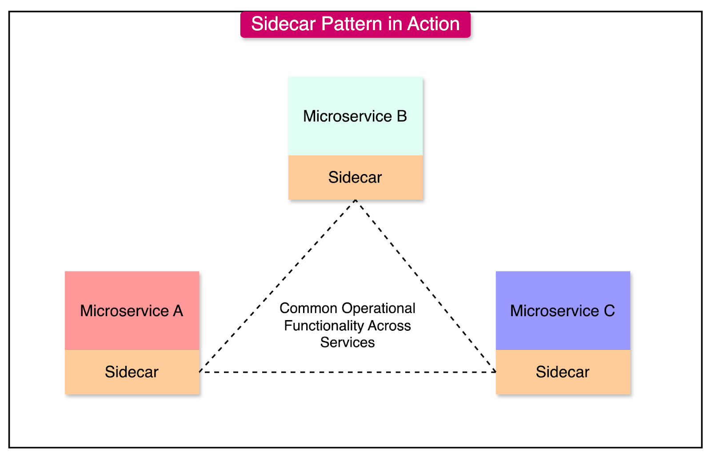
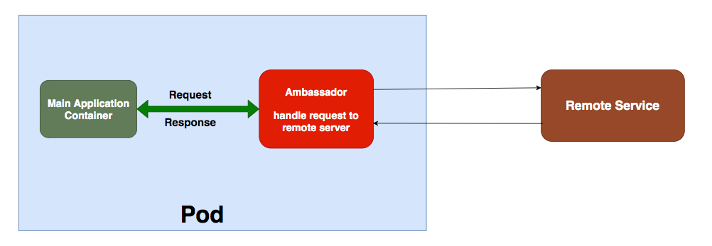

# Sidecar & Ambassador Patterns – Service Mesh Building Blocks

## 🧩 Descripción

Los patrones **Sidecar** y **Ambassador** son patrones de infraestructura que se utilizan comúnmente en arquitecturas de microservicios para mejorar la extensibilidad, conectividad y observabilidad sin modificar el código del servicio principal. Ambos patrones son parte de la familia de **Service Mesh Patterns** y se implementan frecuentemente como contenedores auxiliares en entornos como Kubernetes.

---

## 🧱 Sidecar Pattern

### 📌 ¿Qué es?

El patrón **Sidecar** implica acoplar un contenedor auxiliar al servicio principal. Este contenedor se ejecuta en el mismo pod (en Kubernetes) y proporciona funcionalidades **complementarias** al servicio, como:

- Monitoreo
- Logging
- Autenticación
- Proxy de red
- Caching
- Seguridad

### 🧠 Funcionalidad

El contenedor sidecar comparte el mismo ciclo de vida, red y almacenamiento con el servicio principal, pero opera de manera independiente a su lógica de negocio.

### ✅ Casos de uso

- Recoger métricas y logs (ej. con Prometheus o Fluentd)
- Sidecar proxy (como **Envoy** en Istio)
- Inyección de fallos para pruebas de resiliencia (Chaos Monkey)
- Certificados TLS y renovación automática

---

## 🧱 Ambassador Pattern

### 📌 ¿Qué es?

El patrón **Ambassador** funciona como un **proxy inteligente o intermediario** que representa a un servicio ante el mundo exterior o ante otros servicios. A diferencia del Sidecar, el Ambassador es responsable de:

- Traducción de protocolos
- Autenticación y autorización
- Discovery de servicios
- Balanceo de carga

Actúa como una puerta de entrada (gateway local) al servicio, gestionando la comunicación saliente o entrante.

### ✅ Casos de uso

- Acceso a servicios heredados desde microservicios modernos.
- Gateway API local que abstrae complejidades externas.
- Transformación de payloads (ej. SOAP → REST).

---

🎯 Comparación Sidecar vs. Ambassador
| Característica     | Sidecar                                   | Ambassador                                         |
|--------------------|--------------------------------------------|----------------------------------------------------|
| Ubicación          | Mismo pod, contenedor auxiliar            | Externo o gateway dentro del mismo pod             |
| Función principal  | Funciones de infraestructura              | Representar servicio hacia otros servicios         |
| Comunicación       | Apoya al servicio principal internamente | Gestiona comunicación externa/interna              |
| Casos de uso       | Observabilidad, resiliencia, seguridad    | Proxy, descubrimiento, balanceo de carga           |

---

✅ Beneficios
- 🧩 Desacoplamiento de funcionalidades no funcionales.
- 🔄 Reutilización de componentes sin duplicar lógica.
- 📦 Consistencia en capacidades como monitoreo, trazabilidad y autenticación.
- 🧘 Flexibilidad en despliegue sin modificar el servicio principal.

---

## ⚠️ Desafíos
- Mayor complejidad operativa y de despliegue.
- Uso adicional de recursos (RAM, CPU).
- Necesidad de coordinación en fallos y actualizaciones.
- Dependencia en herramientas como Istio, Linkerd o Consul.

---

[Menú Principal](https://github.com/wilfredoha/cloud-architecture-patterns)