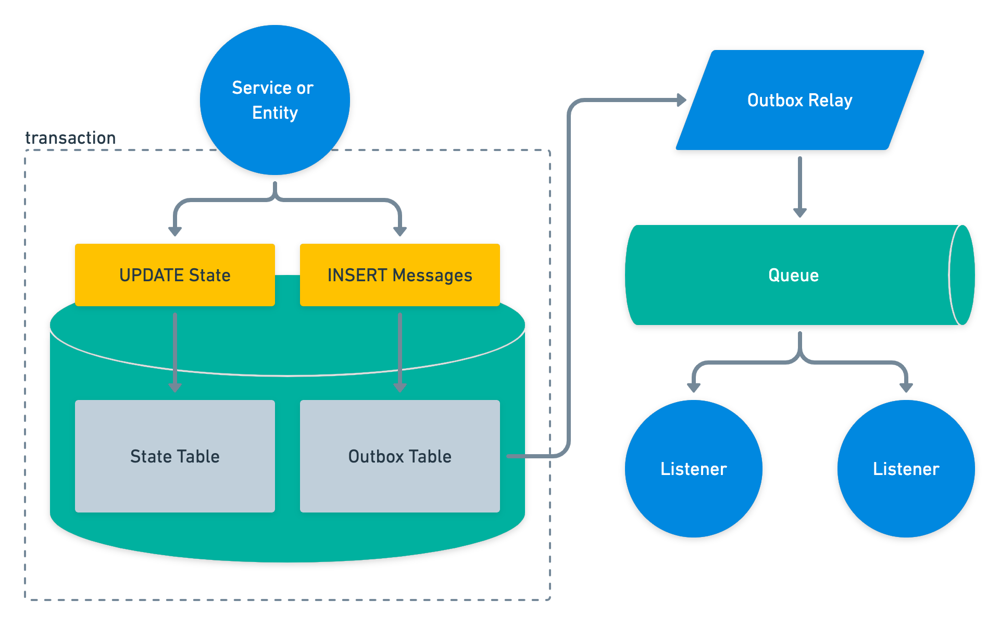

# Transactional Outbox Pattern – Reliability in Event-Driven Architecture

## 🧩 Descripción

El **Transactional Outbox Pattern** permite garantizar la **consistencia entre una base de datos** (donde se realiza una operación de negocio) y **la emisión de un evento** a un sistema de mensajería, evitando así que los servicios se desincronicen.

La clave es registrar eventos como parte de la **misma transacción** que la operación de negocio, escribiéndolos en una tabla especial llamada `outbox`. Posteriormente, un proceso independiente publica esos eventos a un **message broker** como Kafka, RabbitMQ o SQS.

---

## ✅ ¿Qué problema soluciona?

### Problema:
En arquitecturas event-driven, cuando un servicio actualiza su base de datos y luego intenta publicar un evento, puede fallar justo después de la actualización y antes de emitir el evento. Esto rompe la sincronía entre servicios.

### Solución:
El Transactional Outbox Pattern asegura que:
- Los eventos se registran **atómicamente** junto con los datos del negocio.
- Un **publisher asíncrono** se encarga de leer los eventos de la tabla `outbox` y enviarlos al broker, garantizando confiabilidad.

---

## 🎯 Casos de uso

- Servicios que deben comunicar actualizaciones de estado a otros servicios.
- Arquitecturas basadas en eventos (event-driven) donde se requiere confiabilidad.
- Implementación de patrones como **Saga** o **Event Sourcing**.
- Comunicación entre microservicios desacoplados mediante eventos.

---

## 🧱 Componentes del patrón

1. **Outbox Table**  
   Tabla en la base de datos que guarda eventos como registros temporales.

2. **Transacción Local**  
   Operación de negocio + escritura en la outbox en una única transacción.

3. **Event Publisher (Relay / Poller)**  
   Proceso que periódicamente consulta la outbox, publica eventos y marca los procesados.

---

## ✅ Beneficios
- Alta confiabilidad: evita pérdida de eventos incluso si hay fallos en el servicio.
- Compatible con bases de datos tradicionales.
- Funciona con múltiples brokers (Kafka, RabbitMQ, SNS/SQS).
- Permite desacoplamiento entre servicios.

---

## ⚠️ Desafíos
- Necesidad de desarrollar o configurar un publisher que lea la outbox.
- Gestión de errores y reintentos en la publicación.
- Potencial duplicación de eventos (se recomienda usar IDs únicos o semántica de "al menos una vez").
- Mayor complejidad operacional frente a simple publish() directo.

---

[Menú Principal](https://github.com/wilfredoha/cloud-architecture-patterns)